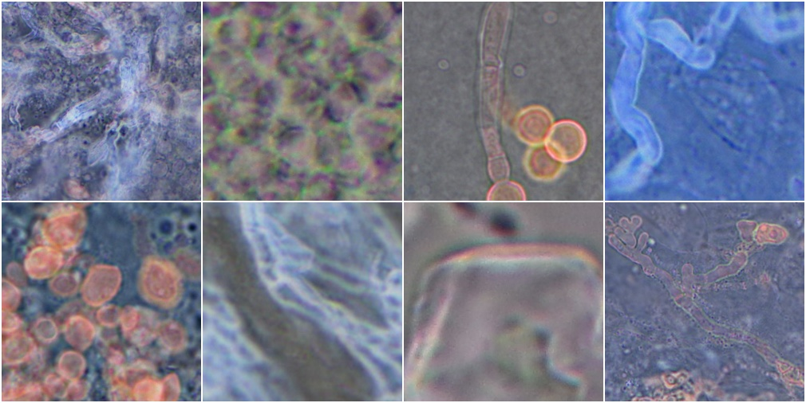

# **🧫 TemFungAI | Detecção de Fungos com Processamento de Imagens**


---



Este repositório contém o projeto desenvolvido para a disciplina de Processamento de Imagens do curso de Sistemas de Informação. O objetivo é aplicar técnicas de pré-processamento em imagens de fungos e avaliar o impacto dessas transformações na performance de modelos de aprendizado de máquina.

A proposta é comparar os resultados obtidos com e sem modificações nas imagens, observando se os ajustes visuais (como filtros, realce, segmentação, entre outros) contribuem para melhorar a acurácia e outros indicadores de desempenho dos classificadores.


---

## 🧰 Tecnologias

-   **Python 3.10+**
-   **Open CV**

---

## 🚀 Iniciando o projeto localmente ou em um Notebook

Follow the steps below to run the project on your local machine.

1.  **Clone the repository:**
    ```bash
    git clone https://github.com/Italo-Fernando/Fungi_Recognition
    cd encurta.py
    ```
2.  **Create and activate a virtual environment:**
    ```bash
    python -m venv venv
    # Windows:
    .\venv\Scripts\activate
    # macOS/Linux:
    source venv/bin/activate
    ```
3.  **Install the dependencies:**
    ```bash
    pip install -r requirements.txt
    ```
4.  **Start the server:**
    ```bash
    uvicorn main:app --reload
    ```
5.  **Access the API**: Open your browser and go to `http://127.0.0.1:8000`. For the interactive documentation, go to `http://127.0.0.1:8000/docs`.

---